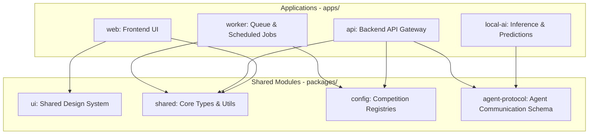

# Architecture Overview

High-level system design and boundaries of the Miraichi monorepo.

## Purpose
This document provides architects and agents an understanding of how applications and packages interact in a competition-agnostic manner.

## Status
- **Status**: Draft

## Scope
Outlines the high-level boundaries of the monorepo workspace. No low-level package configurations or schemas are defined here.

## System Boundaries

### Applications (`apps/`)
- **`web/`**: Next.js/Vite frontend client containing pages, user betting boards, prediction visualizers, and interactive chat dashboards.
- **`api/`**: Node.js/Go backend serving REST/GraphQL APIs, user authentication, bankroll records, and sports data ingestion gates.
- **`local-ai/`**: Python service hosting prediction models, prompt routing engines, and data transformation scripts.
- **`worker/`**: Background worker running tasks like polling sports data, running scheduled batch predictions, and updating user bankrolls.

### Packages (`packages/`)
- **`shared/`**: Common TS/Python models, football entities (matches, markets), and general utility methods.
- **`config/`**: Monorepo configurations, environment schema checks, feature flags, and competition registries.
- **`ui/`**: Framework-agnostic design system tokens, components, and interactive styles.
- **`agent-protocol/`**: Definitions and standards for subagent-to-subagent coordination.

## TODO / Next Steps
- [ ] Establish communication interfaces between apps/api and apps/local-ai.
- [ ] Detail database integration parameters under apps/api.
