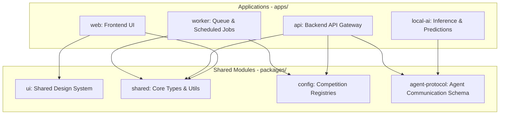

# Architecture Overview

High-level draft system design and boundaries of the Miraichi monorepo.

## Purpose
This document provides architects and agents an understanding of how applications and packages may interact in a competition-agnostic manner during architecture planning.

## Status
- **Status**: Draft

## Scope
Outlines draft high-level boundaries of the monorepo workspace. No low-level package configurations, production schemas, runtime choices, or final architecture decisions are defined here.

## Phase 1 Planning Package
- [phase-1-architecture-planning.md](file:///c:/CODE/miraichi/docs/architecture/phase-1-architecture-planning.md) - Phase 1 discovery goals, non-goals, deliverables, and draft exit criteria.
- [open-architecture-questions.md](file:///c:/CODE/miraichi/docs/architecture/open-architecture-questions.md) - Open questions that must be answered before implementation decisions.
- [architecture-options.md](file:///c:/CODE/miraichi/docs/architecture/architecture-options.md) - Candidate architecture options without final selection.
- [system-boundaries-draft.md](file:///c:/CODE/miraichi/docs/architecture/system-boundaries-draft.md) - Draft responsibilities and prohibited responsibilities across apps and packages.
- [data-flow-draft.md](file:///c:/CODE/miraichi/docs/architecture/data-flow-draft.md) - Generic high-level data flow from provider data to user-facing experiences.
- [llm-local-ai-boundary.md](file:///c:/CODE/miraichi/docs/architecture/llm-local-ai-boundary.md) - Planned LLM versus local AI responsibility boundary.
- [competition-agnostic-review.md](file:///c:/CODE/miraichi/docs/architecture/competition-agnostic-review.md) - Review of competition-coupling risks and recommendations.

## System Boundaries

### Applications (`apps/`)
- **`web/`**: Candidate frontend experience for prediction review, betting-management views, and chat-supported workflows. Final framework and screen scope remain open.
- **`api/`**: Candidate application boundary for client requests, authorization planning, prediction availability, and controlled access to storage, worker, and local AI outputs. Final protocol format remains open.
- **`local-ai/`**: Candidate structured analysis boundary for traceable football prediction generation. Final model runtime, algorithms, and invocation mode remain open.
- **`worker/`**: Candidate background boundary for ingestion, normalization, scheduled jobs, and long-running tasks. Final queue and scheduling technology remain open.

### Packages (`packages/`)
- **`shared/`**: Candidate shared vocabulary and future type conventions for generic concepts such as competition, season, team, match, player, market, prediction, bet, bankroll, and risk rule.
- **`config/`**: Candidate home for configuration guidance, feature flags, environment strategy, and future competition registry planning.
- **`ui/`**: Candidate design-system package for shared user interface primitives and accessibility guidance.
- **`agent-protocol/`**: Definitions and standards for subagent-to-subagent coordination.

## TODO / Next Steps
- [x] Use the Phase 1 planning package to answer open architecture questions (recorded in ADR-0002 through ADR-0011).
- [ ] Execute Phase 1 completion review.
- [ ] Record future technology implementation decisions in later ADRs before Phase 2 skeleton coding begins.
