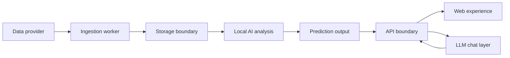

# Data Flow Draft

## Purpose
Draft the expected high-level Miraichi data flow from external football data to user-facing prediction review and chat explanation.

## Status
- **Status**: Draft
- **Phase**: Phase 1 - Architecture Planning
- **Date**: 2026-06-23

## Scope
This document covers generic data flow only. It does not define database tables, provider adapters, API contracts, event schemas, prediction algorithms, betting calculations, or final infrastructure choices.

## Draft Flow

## Boundary Notes
- Data providers supply fixtures, results, statistics, markets, or related football data through provider-specific formats.
- The ingestion worker normalizes provider data into generic concepts before any downstream system consumes it.
- The storage boundary is intentionally undecided and should be evaluated later.
- Local AI consumes validated, normalized data and produces traceable prediction output.
- The API boundary controls how web and LLM chat surfaces access prediction status and results.
- The web experience presents user-facing workflows but does not run analysis or ingestion.
- The LLM chat layer explains, routes, and summarizes through the API boundary; it does not become the prediction source.

## Open Questions
- Which provider data categories are required before prediction generation can be useful?
- What data-quality checks should prevent local AI from producing output?
- Which data freshness signals should appear to users?
- Should prediction output be generated on demand, on schedule, or through both modes?
- What audit trail should connect provider input, normalized data, local AI output, and user-facing explanation?
