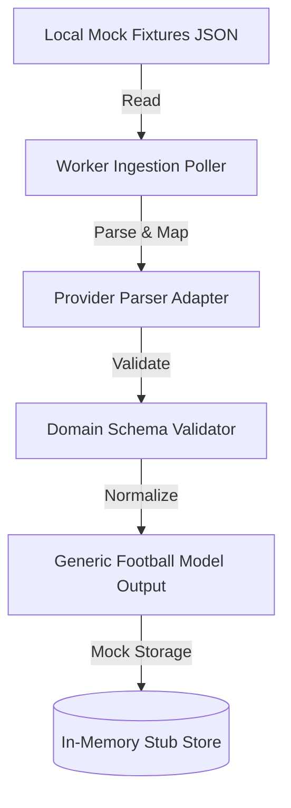

# Phase 3 Data Ingestion Planning

This document details the architecture and roadmap for ingesting sports data under strict Phase 3 guardrails.

## Purpose
Establishes the integration strategy for ingestion feeds, outlining provider abstraction boundaries and mock-first design.

## Status
- **Status**: Closed
- **Revisit Phase**: Phase 3 (Early Planning Gateway)

## Ingestion Architecture & Roadmap
To preserve competition agnosticism and avoid premature database binding, Phase 3 ingestion code must operate in a decoupled, memory-only or mock-persistent manner.

### 1. Local Mock Fixtures Only
- No network requests to live third-party sports APIs (Sportmonks, API-Football, etc.) are allowed during Phase 3 scaffold and testing.
- The `apps/worker` ingestion process reads only from local mock files.
- Sample fixtures utilize generic identifiers (`competition-alpha`, `season-alpha-2026`, `team-alpha`, `team-beta`, `match-alpha-001`).

### 2. Provider Abstraction & Parser Layer
- Ingestion workers do not bind directly to provider-specific response payloads.
- An adapter interface maps inbound data feeds to the internal generic domain model.
- Adding a new provider must only require implementing a new parser adapter, without altering the downstream normalization or verification code.

### 3. Deferring Production Storage
- All database write actions, ORM schemas, and cache invalidation policies are strictly out-of-scope for the opening of Phase 3.
- Normalized fixtures are saved to a temporary in-memory store or mocked console logs to verify parsing correctness.
- Production storage choices remain candidate items on the Phase 3 Decision Backlog.

## TODO / Next Steps
- [ ] Implement local mock provider JSON adapters.
- [ ] Define the TypeScript types for the Parser Adapter interface.
