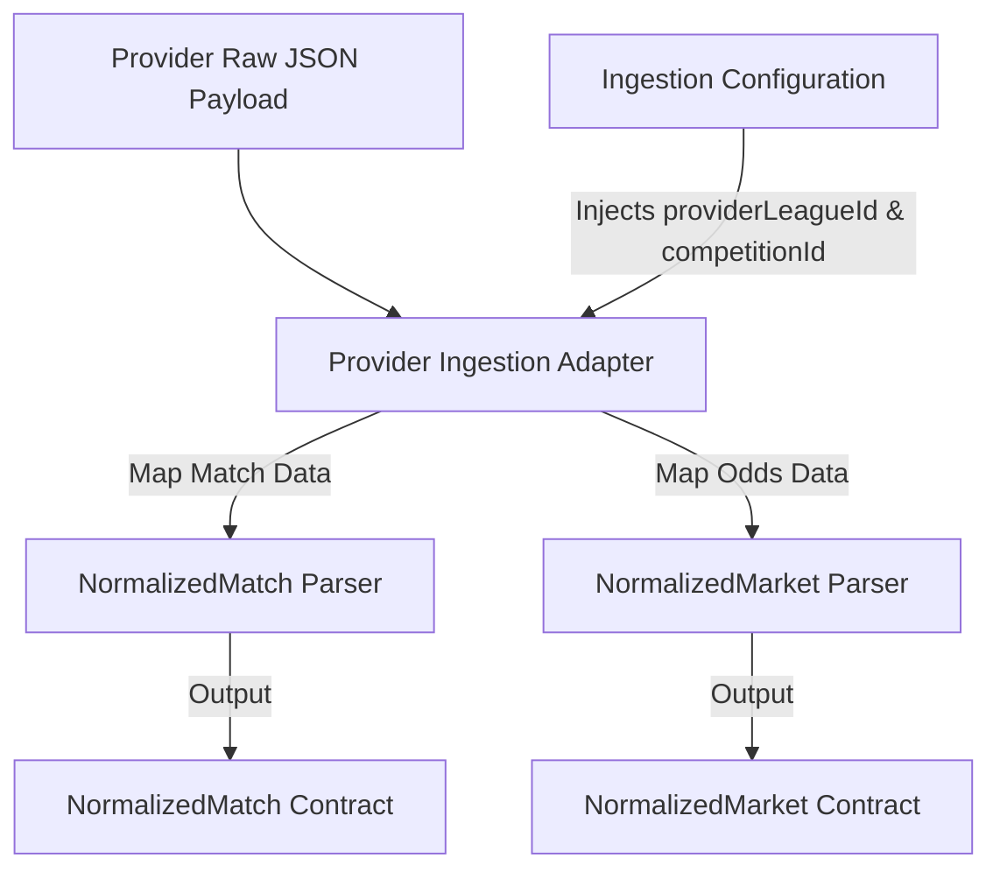
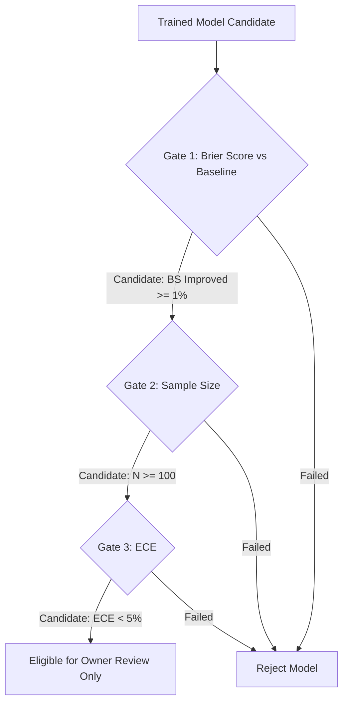

# Phase 7 Planning: Real Data Provider, Dataset, and Evaluation Plan

* **Status**: Partial ADR Acceptance - Remaining Provider/Gate Review Required
* **Date**: 2026-06-28
* **Project**: Miraichi
* **Phase**: Phase 7 Planning

---

## 1. Executive Summary

This document establishes the architecture, methodology, and evaluation framework for integrating real-world sports data feeds into the Miraichi prediction pipeline.

To maintain the core principles of the Miraichi architecture, all data integrations remain adapter-based and competition-agnostic. While the immediate target is full coverage of international football tournament fixtures (such as the FIFA World Cup), the parser structures, datasets, and evaluation metrics are defined generically. This ensures that any football league, cup, or tournament can be ingested and evaluated without code modifications.

Owner review on 2026-06-28 accepted ADR-0036, ADR-0037, ADR-0038, and ADR-0039 as planning boundaries only. ADR-0035 provider selection and ADR-0040 model-readiness gates remain draft.

---

## 2. Sports Data Providers Evaluation

To support fixture ingestion and model evaluation, three candidate sports data providers were evaluated: **API-Football (RapidAPI)**, **Football-Data.org**, and **TheOdds-API**.

### 2.1 Provider Comparison Matrix

| Feature / Dimension | API-Football (RapidAPI) | Football-Data.org | TheOdds-API |
| :--- | :--- | :--- | :--- |
| **Primary Data Focus** | Deep match statistics, historical lineups, events, and bookmaker odds | Standard fixtures, schedules, league standings, and basic scores | Multi-bookmaker pre-match and live odds across sports |
| **Free Tier Quota** | Owner must confirm current free-tier quota and terms | 10 calls/minute on the official free plan | 500 credits/month on the official Starter plan |
| **Free Plan Cost Position** | Owner must confirm | Free plan shown at EUR 0/month | Starter plan shown as FREE |
| **Rate / Concurrency Limits** | Owner must confirm | 10 calls/minute | Credit-based quota; exact request cost depends on endpoint and parameters |
| **Historical Depth** | Owner must confirm | Limited on free tier | No historical odds on the free Starter plan |
| **Unified Coverage** | Both fixture metadata and odds under one API | Fixture metadata only; odds are omitted on free tier | Odds data only; lacks match stats or scores |
| **Draft Recommendation** | **Primary Candidate** | **Secondary/Backup Candidate (Fixtures only)** | **Secondary/Backup Candidate (Odds only)** |

### 2.2 Source Notes
Provider limits, coverage, and pricing can change. The current candidate matrix should be rechecked during owner review against:
* API-Football pricing and coverage: [pricing](https://www.api-football.com/pricing), [coverage](https://www.api-football.com/coverage). CLI verification from this workspace returned HTTP 403 on 2026-06-28, so the API-Football quota and coverage claims remain candidate claims pending owner-side confirmation.
* Football-Data.org pricing and coverage: [pricing](https://www.football-data.org/pricing), [coverage](https://www.football-data.org/coverage).
* The Odds API plan and feature pages: [home/pricing](https://the-odds-api.com/), [API guide](https://the-odds-api.com/liveapi/guides/v4/).

### 2.3 Owner-Only Free Pilot Constraints
If owner review confirms API-Football's current free tier is usable, the first implementation plan should still be restricted to a one-person owner pilot:
* **Usage Scope**: One project owner user only. No public users and no multi-user usage.
* **Cost Scope**: Free tier only. No paid plan or automatic upgrade without a separate owner decision.
* **Quota Controls**: Hard daily/monthly quota guards, throttling, and batch checkpoints are mandatory.
* **Cache Controls**: Raw responses must be cached locally before any normalization or dataset build.
* **Promotion Boundary**: Provider data can support internal dataset construction and reports only. It does not authorize live prediction recommendations.

### 2.4 Provider Recommendation
**API-Football** is the primary owner-only free-tier provider candidate for owner review, not an accepted provider selection. If verified and accepted, using a single provider reduces the complexity of joining disparate match identifiers, which would be required if merging Football-Data.org fixtures with TheOdds-API odds. If API-Football's current free tier is not acceptable, Football-Data.org should be used as a fixture/results fallback and The Odds API should be used as an odds-only fallback.

---

## 3. FIFA World Cup Ingestion & Competition-Agnostic Design

To fulfill the goal of ingesting tournament data (e.g. FIFA World Cup) while keeping the core codebase agnostic of any single tournament, the ingestion system utilizes a dynamic configuration and adapter-based pattern.

### 3.1 Agnostic Configuration Schema
The system avoids hardcoded strings (such as `"World Cup"` or `"FIFA"`) in the parser, worker, or prediction engine. Instead, a dynamic mapping is defined in the configuration layer:

```typescript
// packages/shared/src/config/competitions.ts
export interface IngestionConfig {
  provider: 'api-football' | 'football-data' | 'the-odds-api';
  providerLeagueId: number;   // E.g., league ID used by API-Football
  competitionId: string;      // Generic internal UUID/identifier
  seasonYear: number;         // E.g., 2026
}
```

The future worker should read this configuration at runtime, instructing the provider adapter to fetch and parse the data matching `providerLeagueId`. Downstream systems should only see `competitionId`.

### 3.2 Parser Flow & Normalization
The ingestion pipeline follows a strict normalization flow:



1. **Raw Payload Ingestion**: The raw JSON API response should be fetched and immediately written to the local cache.
2. **Parser Translation**: The provider adapter processes the raw JSON, converting fields into the standard TypeScript interfaces defined in [contracts](file:///c:/CODE/miraichi/packages/shared/src/contracts):
   * **[normalized-match-contract.ts](file:///c:/CODE/miraichi/packages/shared/src/contracts/normalized-match-contract.ts)**: Maps the provider's fixture object (teams, kickoff time, venue, scores, status).
   * **[normalized-market-contract.ts](file:///c:/CODE/miraichi/packages/shared/src/contracts/normalized-market-contract.ts)**: Maps the provider's odds object (market name such as `1X2`, outcomes, and decimal odds values).
3. **Internal Registry Mapping**: The provider's team IDs and league IDs should be translated into internal generic keys (`team-alpha`, `competition-beta`) using a dynamic registry configuration or store approved in a later implementation plan.

---

## 4. Dataset Boundaries and Splits

To design, train, and validate the prediction model, the historical and tournament datasets are partitioned into three chronological splits. This partitioning prevents look-ahead bias and mimics real-world deployment.

### 4.1 Chronological Splits

* **Train Set (Historical Match Data: 2018–2024)**:
  * **Scope**: Historical league and international tournament matches.
  * **Purpose**: Used to train the local AI model parameters, establish feature baselines, and fit prediction distributions.
* **Validation Set (Recent Matches: 2024–2025)**:
  * **Scope**: Recent domestic seasons and continental tournament qualifiers.
  * **Purpose**: Used for hyperparameter tuning, feature selection, and threshold optimization.
* **Test Set (Out-of-Sample: 2026 or Target Tournament)**:
  * **Scope**: Fixtures from the target tournament or the 2026 season.
  * **Purpose**: Serves as the final out-of-sample benchmark to verify model-readiness gates.

### 4.2 Raw Ingestion Cache Strategy
To ensure strict data lineage and allow offline R&D without re-querying third-party APIs, the future ingestion engine should implement a raw cache layer:
* **Storage Location**: `apps/local-ai/data/raw/`
* **Directory Structure**:
  * Raw Fixtures: `apps/local-ai/data/raw/fixtures/{competitionId}/{seasonYear}/{date}.json`
  * Raw Odds: `apps/local-ai/data/raw/odds/{competitionId}/{seasonYear}/{matchId}.json`
* **Mechanism**: Every HTTP response body returned by the provider should be written to disk alongside metadata (fetch timestamp, status code). When performing feature engineering or running backtests, the pipeline should read from this local directory first. If a file exists, it should skip the network request. This preserves reproducibility of training runs.

---

## 5. Evaluation Methodology

A model's performance must be evaluated against a hard, market-driven baseline. The evaluation framework computes the accuracy and calibration of predicted probabilities against implied bookmaker probabilities.

### 5.1 Implied Odds Baseline Calculation
Bookmaker odds represent the market's collective prediction, adjusted for the bookmaker's margin (the overround). To establish the prediction baseline, decimal odds are converted to normalized implied probabilities.

For a 3-way match outcome (Home Win, Draw, Away Win) with decimal odds $O_H$, $O_D$, and $O_A$:
1. Calculate raw implied probabilities:
   $$P'_H = \frac{1}{O_H}, \quad P'_D = \frac{1}{O_D}, \quad P'_A = \frac{1}{O_A}$$
2. Calculate the bookmaker's margin/overround:
   $$S = P'_H + P'_D + P'_A$$
3. Normalize the probabilities so they sum to exactly 1.0:
   $$P_H = \frac{P'_H}{S}, \quad P_D = \frac{P'_D}{S}, \quad P_A = \frac{P'_A}{S}$$

This normalized probability distribution $(P_H, P_D, P_A)$ serves as the baseline prediction for each fixture.

### 5.2 Performance Metrics
The prediction engine is evaluated using two primary metrics:

#### 5.2.1 Brier Score
The Brier Score measures the mean squared error between predicted probabilities and actual binary outcomes. For multi-class outcomes (Home, Draw, Away):
$$BS = \frac{1}{N} \sum_{n=1}^{N} \sum_{c \in \{H, D, A\}} (p_{n, c} - y_{n, c})^2$$
Where:
* $N$ is the total number of matches.
* $p_{n, c}$ is the model's predicted probability for outcome $c$ of match $n$.
* $y_{n, c}$ is a binary indicator ($1$ if outcome $c$ occurred, $0$ otherwise).

#### 5.2.2 Expected Calibration Error (ECE)
The ECE measures how well the model's predicted probabilities align with real-world frequencies. Predictions are grouped into $M$ equally spaced confidence bins $B_1, B_2, \dots, B_M$ (e.g., 10 bins from $0.0$ to $1.0$).
$$ECE = \sum_{m=1}^{M} \frac{|B_m|}{N} \left| \text{acc}(B_m) - \text{conf}(B_m) \right|$$
Where:
* $|B_m|$ is the number of predictions in bin $m$.
* $\text{acc}(B_m)$ is the actual accuracy (empirical frequency of positive outcomes) in bin $m$.
* $\text{conf}(B_m)$ is the average predicted probability (confidence) in bin $m$.

### 5.3 Backtesting Framework
Backtests must simulate real-world conditions to prevent look-ahead bias (data leakage):
* **Temporal Sorting**: All historical matches are ordered chronologically by kickoff time.
* **Feature Horizon**: When predicting a match at kickoff time $T$, the feature extraction routine must only utilize matches completed strictly before $T$.
* **Rolling Verification**: The evaluation script simulates a weekly step: generating predictions for upcoming fixtures, recording predictions, observing outcomes, updating historical stats, and advancing the kickoff window.

---

## 6. Model-Readiness Gates

ADR-0040 remains draft. The thresholds below are candidate owner-only R&D report gates only. They do not authorize staging promotion, live suggestions in the PWA, public predictions, betting recommendations, stake sizing, bankroll logic, or automated model promotion.



### 6.1 Gate 1: Brier Score Improvement
* **Candidate Requirement**: The model's Brier Score on the out-of-sample Test Set should be at least 1% better (lower) than the bookmaker implied probability baseline:
  $$\frac{BS_{\text{baseline}} - BS_{\text{model}}}{BS_{\text{baseline}}} \ge 0.01$$
* **Rationale**: Bookmaker odds represent a highly efficient baseline. Achieving an improvement of $\ge 1\%$ ensures the model extracts predictive value beyond basic market pricing.

### 6.2 Gate 2: Sample Size Threshold
* **Candidate Requirement**: The out-of-sample Test Set should contain a minimum of 100 historical match fixtures.
* **Rationale**: A small test sample is susceptible to statistical noise and lucky predictions. If the target tournament has fewer than 100 matches (e.g., a standard tournament with 64 games), the Test Set must be augmented with additional out-of-sample historical fixtures from similar elite competitions (e.g., Euros, Champions League) to reach the 100-match threshold.

### 6.3 Gate 3: Expected Calibration Error (ECE) Constraint
* **Candidate Requirement**: The Expected Calibration Error (ECE) on the out-of-sample Test Set should be strictly less than 5%:
  $$ECE < 0.05$$
* **Rationale**: If the model is poorly calibrated, downstream explanations and future risk workflows become misleading. A calibration error under 5% is only a candidate review target; it does not guarantee that predicted probabilities map accurately to actual outcome frequencies.
