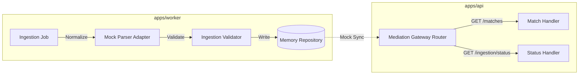

# Worker-API Ingestion Boundary

* **Status**: Draft
* **Date**: 2026-06-23

---

## 1. Purpose
Defines the functional boundary, communication interfaces, and separation of concerns between `apps/worker` and `apps/api`.

---

## 2. Component Decoupling & Responsibilities

### Worker Daemon Responsibilities
1. **Mock File Reading**: Polls static raw mock files from the `fixtures/` directory.
2. **Normalizing**: Transforms raw provider structures using parser adapters.
3. **Filtering & Validating**: Verifies that match scores are non-negative and odds decimal values are positive.
4. **Local Memory Storage**: Appends accepted records to a volatile transient repository.

### API Gateway Responsibilities
1. **Exposing Endpoints**: Serves matches and run metrics via mediation route queries (`/api/v1/matches`, `/api/v1/ingestion/status`).
2. **Mediation Routing**: Proxies predictions and explanation chats to AI engines.
3. **Mock Presentation**: Displays placeholder status logs.

---

## 3. Communication Contract
* Both applications run as independent operating system daemons.
* Shared contract data shapes reside in `@miraichi/shared`.
* No relational database tables or shared Redis caching servers exist between the processes.
