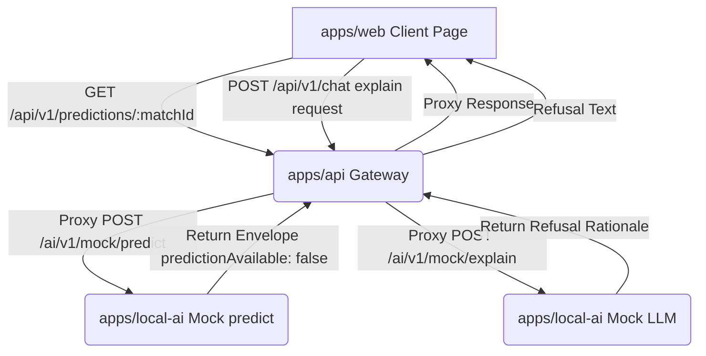

# Phase 4.4 Mock Pipeline Integration Plan

* **Date**: June 23, 2026
* **Status**: **Draft**

---

## 1. Scope & Goals
This plan specifies how the API gateway (`apps/api`) and the Web user interface (`apps/web`) integrate with the mock local-ai service (`apps/local-ai`). The goal is to define the communication boundaries, failure handling mechanisms, traceability flows, and UX rules without coding active ML algorithms or betting recommendation calculations.

---

## 2. Integration Architecture Flow

---

## 3. Failure Handling & Outages
If the downstream `apps/local-ai` service becomes unreachable or throws an exception:
* **API Gateway Action**: The API gateway must catch the network exception and return a standard, safe fallback envelope with `predictionAvailable: false`, `engineMode: "mock"`, `confidenceLabel: "not_available"`, and a warning list containing `["downstream_service_unreachable"]`.
* **Web UI Action**: The web application must display a clear, neutral error message (e.g. `"Prediction service is temporarily unavailable."`) and must never invent fallback prediction outcomes or speculate on the winner.

---

## 4. Future Pluggable Integrations
* **Real Predictions**: Swapping the mock inference endpoints for active classifiers requires a new owner-approved strategy ADR.
* **LLM Explanation**: Hooking the explainer to a live model (local or API-based) requires a separate owner-approved ADR.
* **Betting recommendation**: Simulating wagers, placing slips, or evaluating bankroll ROI requires an owner-approved ADR.
