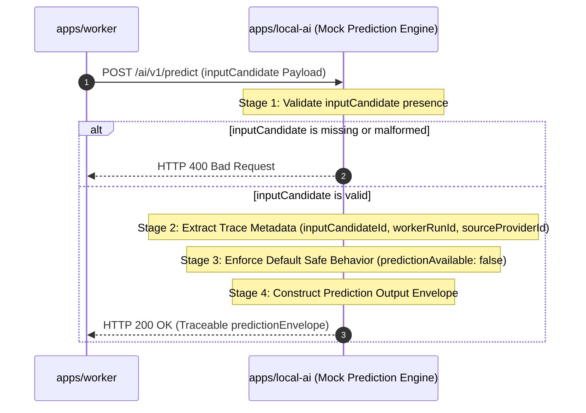

# Input Candidate to Prediction Envelope Flow

* **Status**: Draft
* **Date**: June 23, 2026

---

## 1. Sequence Flow Diagram
The diagram below shows how `apps/local-ai` processes the `inputCandidate` snapshot to output the traceable prediction envelope:

---

## 2. Processing Steps & Mappings

### Step 1: Input Validation
The local AI service verifies that the incoming request body contains the required properties defined in the handoff contract:
* Check for presence of `inputCandidateId`, `matchId`, `competitionId`, `seasonId`, and the `trace` object (`workerRunId`).
* If any of these fields are missing, the engine immediately aborts execution and throws a validation exception.

### Step 2: Trace Propagation
To guarantee lineage, the mock prediction engine copies reference identifiers from the input candidate directly into the output envelope's `trace` block:
* `predictionEnvelope.trace.inputCandidateId` = `inputCandidate.inputCandidateId`
* `predictionEnvelope.trace.workerRunId` = `inputCandidate.trace.workerRunId`
* `predictionEnvelope.trace.sourceProviderId` = `inputCandidate.sourceProviderId`
* `predictionEnvelope.trace.engineVersion` = Current code package version of `apps/local-ai`.

### Step 3: Default Envelope Construction
The mock engine builds the standard envelope. To respect owner decision gates, it enforces default safe values:
* `predictionAvailable` = `false`
* `engineMode` = `"mock"`
* `confidenceLabel` = `"not_available"`
* `outputSummary` = `"no owner-approved prediction algorithm is active"`
* `warnings` = Any warnings copied from `inputCandidate.dataQualityIssues`.
