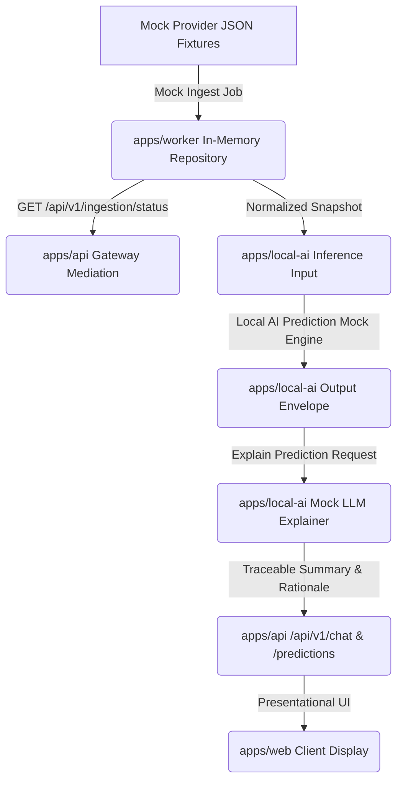

# Phase 4 Planning: Local AI Input Pipeline and Prediction Engine

* **Date**: June 23, 2026
* **Status**: Closed

---

## 1. Objectives
The primary goal of Phase 4 is to plan the predictive capability boundary of the Miraichi architecture. This includes:
1. Mapping input candidate payloads from `apps/worker` ingestion structures.
2. Standardizing the prediction output envelope schema with traceability elements.
3. Defining the LLM explanation and refusal boundary rules.
4. Setting up a local mock prediction engine within `apps/local-ai` to verify service integration without active ML models or algorithms.

---

## 2. Integration Architecture Flow
Predictions follow a unidirectional, traceable pipeline from source ingestion to client explanation:

---

## 3. High-Level Planning Timeline & Milestones
Execution of Phase 4 proceeds in the following structured steps:

* **Step 4.1: Input and Output Contract Definition**
  * Finalize the properties of normalized match/market items mapped into the AI candidate boundary.
  * Define schema elements of the output prediction envelope including trace references.
* **Step 4.2: LLM Refusal Prompt and Explanation Strategy**
  * Establish prompt guidelines requiring LLMs to explain only existing local prediction models.
  * Formulate standard prompt refusal payloads when predictions are unavailable.
* **Step 4.3: Mock Prediction Engine Implementation**
  * Implement mock prediction and explanation route handlers in `apps/local-ai`.
  * Validate that no active mathematical/probability formulas are executed.
* **Step 4.4: End-to-End Pipeline Verification**
  * Verify that tracing metadata (`runId`, `sourceProviderId`, `inputCandidateId`) propagates successfully from initial worker fixtures through the API gateway to final explanations.
