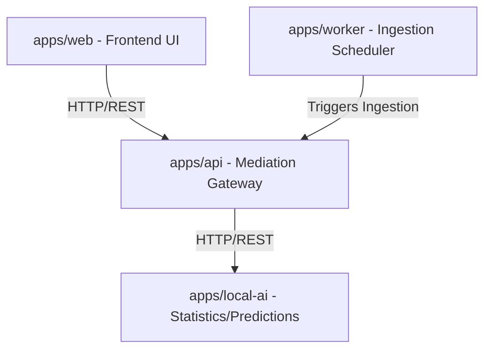

# App Skeleton Scope

This document specifies the files, entry points, and architectural boundaries to be created under the `apps/` directory during Phase 2.

## Apps Overview

---

## 1. Web Client App (`apps/web`)

The web client serves the human user interface.

### Files to Scaffold
* `apps/web/package.json` — Frontend dependency configurations.
* `apps/web/index.html` — Base HTML entry point.
* `apps/web/src/main.js` or `src/main.ts` — React/Vite/Vanilla entry point.
* `apps/web/src/App.js` or `App.tsx` — Main application layout, including navigation router.
* `apps/web/src/components/` — Skeletal components for:
  - Navigation / Sidebar (Dashboard, Chat, Bet History)
  - Dashboard (Generic list of matches with prediction badges)
  - PredictionDetail (Detailed stats, model trace, and prompt routing log)
  - ChatBot (Interactive panel for explaining predictions)
  - BetHistoryList (Read-only list layout with mock audit logs)
* `apps/web/src/styles/` — Style definitions importing `packages/ui` foundation.

### Boundary Rules
* Page routing must be active, allowing navigation between Dashboard, Chat, and Bet History.
* All data fetching must call `apps/api` endpoints using clean fetch clients; fallback to mock frontend data is allowed only if API is offline.
* Absolutely no sports-specific algorithms or database scripts.

---

## 2. API Mediation Gateway (`apps/api`)

The gateway intercepts client requests, orchestrates downstream requests to `apps/local-ai`, and serves ingestion results.

### Files to Scaffold
* `apps/api/package.json` — Server dependency configs.
* `apps/api/src/server.js` or `src/server.ts` — Express/Fastify/Nest server bootstrap.
* `apps/api/src/routes/` — Route controllers for:
  - `/api/v1/matches` — Generic tournament fixtures.
  - `/api/v1/predictions` — Match prediction logs with model traces.
  - `/api/v1/chat` — Conversational explanation requests (relayed to LLM stubs).
  - `/api/v1/bets` — Simulated bet history audit logger (write-to-memory only).
* `apps/api/src/middleware/` — Request logging and error handling.

### Boundary Rules
* The API must act as the sole mediator for `apps/web`.
* Downstream requests to `apps/local-ai` must map headers for auditing.
* Storage is strictly ephemeral in-memory variables. No SQLite, MongoDB, or PostgreSQL databases.

---

## 3. Local AI Server (`apps/local-ai`)

Serves as the statistics processor and LLM connector.

### Files to Scaffold
* `apps/local-ai/package.json` — Dev/production runtime dependencies.
* `apps/local-ai/src/server.js` or `src/server.ts` — Inference service bootstrap.
* `apps/local-ai/src/routes/` — Endpoint controllers:
  - `/ai/v1/predict` — Stubbed prediction generator returning generic JSON predictions.
  - `/ai/v1/explain` — Mock chatbot response returning prompt routing logs.
* `apps/local-ai/src/models/` — Stub folders for weight/prompt configuration.

### Boundary Rules
* Predictions must not run live neural network/statistical modeling. Returns static, mock-generated data blocks.
* Conversational responses must follow the refusal/scope safety bounds (ADR-0007).

---

## 4. Worker Agent (`apps/worker`)

Runs periodic tasks such as fake provider sports ingestion.

### Files to Scaffold
* `apps/worker/package.json` — Worker process environment config.
* `apps/worker/src/index.js` or `src/index.ts` — Daemon bootstrap.
* `apps/worker/src/jobs/` — Job runner stubs:
  - `sports-ingestion-cron` — Poller that pulls mock fixture logs from a static JSON file.
* `apps/worker/src/services/` — Mock feed transform pipeline.

### Boundary Rules
* The cron job should run on a local timer interval (e.g. once per minute) and log task ticks.
* Feeds must be mock local JSON data, never connecting to external endpoints.
