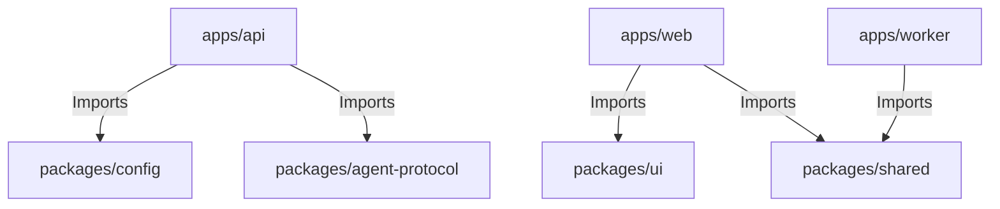

# Package Skeleton Scope

This document specifies the directories, files, configurations, and linkage boundaries for all shared components located in the `packages/` directory during Phase 2.

## Packages Overview

---

## 1. Shared Utilities (`packages/shared`)

Provides generic helper methods, data formatters, and shared types.

### Files to Scaffold
* `packages/shared/package.json` — Monorepo export configs.
* `packages/shared/src/index.js` or `src/index.ts` — Main export interface.
* `packages/shared/src/types/` — Common type definitions (Match, Prediction, AuditLog).
* `packages/shared/src/utils/` — Non-business logic helper scripts (date formats, log wrappers).

### Boundary Rules
* Code in this package must be completely pure. No network fetching or database connections inside `packages/shared`.
* Re-exported types must be competition-agnostic.

---

## 2. Configuration Package (`packages/config`)

Manages environment configuration loaders and registry mappings.

### Files to Scaffold
* `packages/config/package.json` — Configuration dependencies.
* `packages/config/src/index.js` or `src/index.ts` — Main export interface.
* `packages/config/src/loader.js` — Core environment loader (loads `.env` variables and runs sanity checks).
* `packages/config/src/competitions/` — Empty structures for competition registries (to be loaded dynamically in Phase 3).

### Boundary Rules
* Do not commit any secrets (API tokens, database credentials) to this directory. Use generic `.env.example` templates.
* Configuration structures must support loading arbitrary, dynamically registered tournament profiles rather than hardcoding.

---

## 3. UI Component Library (`packages/ui`)

Defines the styling system, design tokens, and vanilla CSS foundation.

### Files to Scaffold
* `packages/ui/package.json` — UI style configurations.
* `packages/ui/src/index.css` — Global CSS stylesheet defining design tokens:
  - Color palettes (custom HSL tokens for dark/light themes).
  - Typography settings (fonts, scales, line heights).
  - Spacing variables.
* `packages/ui/src/components/` — Stateless visual skeletons (e.g., Buttons, Cards, Modal wrappers) using Vanilla CSS.

### Boundary Rules
* Vanilla CSS must be used for all styling. No TailwindCSS.
* Components must be purely presentational (no state management or API fetch logic).

---

## 4. Agent Protocol (`packages/agent-protocol`)

Governs structured JSON messaging and handoff routines between agents and services (ADR-0011).

### Files to Scaffold
* `packages/agent-protocol/package.json` — Protocol configuration.
* `packages/agent-protocol/src/index.js` or `src/index.ts` — Export entries.
* `packages/agent-protocol/src/schemas/` — JSON schema validations for:
  - Handoff packets.
  - LLM system messages.
  - Trace envelopes.

### Boundary Rules
* Strictly validates data structures. If a payload violates the schema, the parser must reject it.
