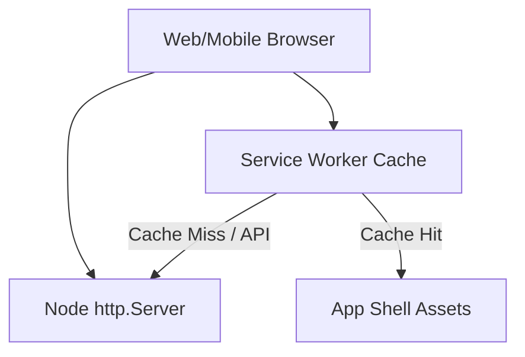

# PWA-First Client Delivery Strategy Design Spec

* **Date**: 2026-06-23
* **Status**: Proposed
* **Topic**: PWA-First Client Delivery Strategy and Web Client PWA-readiness

---

## 1. Goal
Make Miraichi a Progressive Web App (PWA) and optimize it for mobile delivery, keeping desktop functional while explicitly deferring native iOS development.

## 2. Requirements & Exclusions
* **Inclusions**:
  * PWA metadata (`manifest.webmanifest`), SVG fallback icon (`icon.svg`), and service worker (`service-worker.js`) caching only static assets (app shell).
  * Web routing for `/manifest.webmanifest`, `/service-worker.js`, and icon files.
  * Register service worker cleanly without push notifications or background sync.
  * Correct HTML viewport and add iOS meta tags.
  * Make UI responsive, adding safe-area padding and preventing overflow.
  * PWA verification script (`scripts/pwa-verify.js`).
* **Exclusions**:
  * No native iOS app, Swift/SwiftUI, React Native, Expo, Capacitor, Cordova.
  * No App Store deployment or push notifications.
  * No prediction/betting logic, databases, providers, or secrets.
  * No hard-coded World Cup or team/league names.

## 3. Options Considered
* **Option A (Recommended)**: Horizontal scroll navigation bar on mobile screens. Keeps the existing single menu structure, avoids splitting UI into top/bottom layouts, and maintains a highly clean desktop and mobile experience.
* **Option B**: Bottom tab layout with separate top header on mobile. Requires splitting navigation component into mobile-specific subcomponents, increasing complexity.
* **Option C**: Hamburger menu. Requires adding JavaScript interaction state and menu toggle buttons.

We choose **Option A** as the most elegant, surgical, and robust option.

## 4. Proposed Changes

### 4.1. Architecture & Design
The system will run as a single-page app (SPA) server which will serve static public assets. A service worker will cache static shell assets (`/`, `/index.html`, `/packages/ui/src/index.css`) using a cache-first strategy. API paths (`/api/`, `/ai/`) will be network-first.

### 4.2. File Modifications & Additions

* **[NEW] [ADR-0022](file:///c:/CODE/miraichi/docs/decisions/ADR-0022-client-delivery-strategy-pwa-first-native-ios-deferred.md)**: Document the architecture choice.
* **[MODIFY] [index.js](file:///c:/CODE/miraichi/apps/web/src/index.js)**:
  * Route `/manifest.webmanifest`, `/service-worker.js`, and icon files (`/icons/icon.svg`, `/icons/icon-180.png`, etc.) to the respective physical files.
  * Update HTML shell viewport tag to `width=device-width, initial-scale=1, viewport-fit=cover`.
  * Add PWA/iOS meta tags and manifest link.
  * Import `/apps/web/src/pwa/register-service-worker.js`.
  * Adapt `.nav-bar` for narrow screens with horizontal scrolling.
* **[NEW] [manifest.webmanifest](file:///c:/CODE/miraichi/apps/web/public/manifest.webmanifest)**: PWA web manifest.
* **[NEW] [service-worker.js](file:///c:/CODE/miraichi/apps/web/public/service-worker.js)**: Service worker shell caching.
* **[NEW] [icon.svg](file:///c:/CODE/miraichi/apps/web/public/icons/icon.svg)**: Simple placeholder SVG icon.
* **[NEW] [register-service-worker.js](file:///c:/CODE/miraichi/apps/web/src/pwa/register-service-worker.js)**: Register the service worker safely.
* **[MODIFY] [index.css](file:///c:/CODE/miraichi/packages/ui/src/index.css)**: Mobile-first utility and safe area variables/padding if needed.
* **[NEW] [pwa-verify.js](file:///c:/CODE/miraichi/scripts/pwa-verify.js)**: Check compliance and ensure no native/push logic is present.
* **[MODIFY] [package.json](file:///c:/CODE/miraichi/package.json)**: Add `pwa:verify` command.
* **[NEW] [PHASE-4-6-PWA-FIRST-CLIENT-ALIGNMENT-REPORT.md](file:///c:/CODE/miraichi/docs/web/PHASE-4-6-PWA-FIRST-CLIENT-ALIGNMENT-REPORT.md)**: Final report.

---

## 5. Spec Self-Review
1. **Placeholder scan**: No TBD/TODO placeholder text.
2. **Internal consistency**: Viewports and meta tags align with register script and service worker scope.
3. **Scope check**: Well-scoped and contains only PWA shell configuration.
4. **Ambiguity check**: Exclusions and inclusions are clearly delineated.
